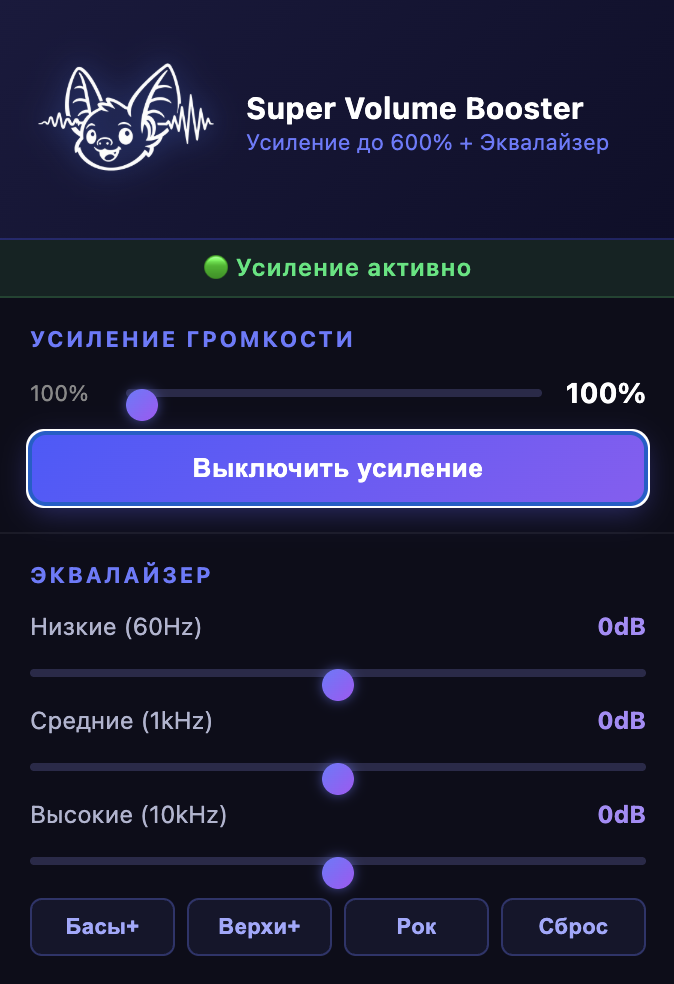
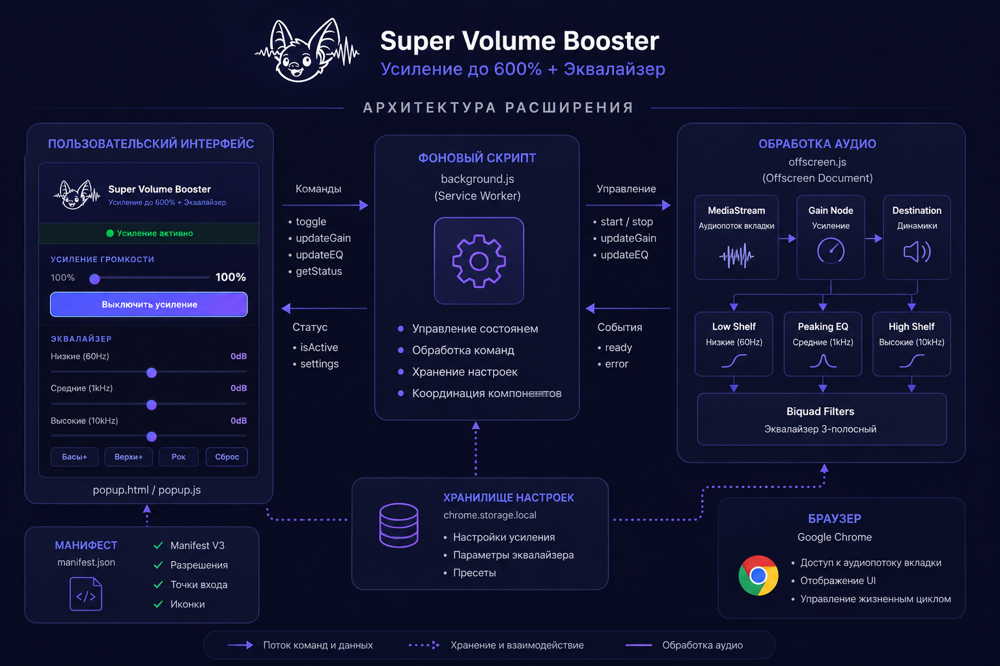

<div align="center">
  

  <h1>Super Volume Booster & Equalizer</h1>

  <p>
    <strong>Бесплатное open-source расширение для Google Chrome: усилитель громкости до 600% и 3-полосный эквалайзер без слежки.</strong>
  </p>

  <p>
    Усиливает звук активной вкладки, позволяет настраивать низкие, средние и высокие частоты,
    хранит настройки локально и не отправляет данные пользователя на внешние серверы.
  </p>

  <p>
    <a href="./LICENSE"></a>
    
    
    
    
  </p>

  <p>
    <a href="https://github.com/kokarevn/super-volume-booster/releases/latest/download/super-volume-booster-extension.zip">
      
    </a>
  </p>

  <p>
    <a href="#возможности">Возможности</a> ·
    <a href="#интерфейс">Интерфейс</a> ·
    <a href="#установка">Установка</a> ·
    <a href="#архитектура">Архитектура</a> ·
    <a href="#конфиденциальность">Конфиденциальность</a>
  </p>
</div>

---

## О проекте

**Super Volume Booster & Equalizer** — это расширение для Google Chrome, которое усиливает звук активной вкладки и позволяет настраивать звучание через простой эквалайзер.

Проект создан как прозрачная и безопасная альтернатива сомнительным бесплатным аудио-расширениям. Код открыт, обработка звука выполняется локально в браузере, а настройки сохраняются только на устройстве пользователя.

> Расширение не использует аналитику, не содержит рекламных или трекинговых скриптов и не передаёт историю просмотров, аудио или настройки на внешние серверы.

## Возможности

- Усиление громкости активной вкладки до **600%**.
- 3-полосный эквалайзер: низкие, средние и высокие частоты.
- Готовые пресеты: **Басы+**, **Верхи+**, **Рок**, **Сброс**.
- Сохранение выбранных настроек в `chrome.storage.local`.
- Архитектура на **Manifest V3**.
- Обработка аудио через **Web Audio API**.
- Минимально необходимые разрешения.
- Отсутствие аналитики, телеметрии и фонового сбора данных.

## Интерфейс

<p align="center">
  
</p>

<p align="center">
  <em>Всплывающее окно расширения: усиление громкости, эквалайзер и быстрые пресеты.</em>
</p>

## Установка

Пока расширение не опубликовано в Chrome Web Store, его можно установить вручную из релизного ZIP-архива. В архив для установки входят только файлы, необходимые для работы расширения, без документации, README и служебных материалов репозитория.

<div align="center">
  <a href="https://github.com/kokarevn/super-volume-booster/releases/latest/download/super-volume-booster-extension.zip">
    
  </a>
</div>

### Установка из ZIP-архива

1. Нажмите кнопку **«Скачать расширение»** выше.
2. Распакуйте скачанный архив `super-volume-booster-extension.zip`.
3. Внутри должна быть папка `super-volume-booster-extension` с файлами `manifest.json`, `background.js`, `popup.html`, `popup.js`, `offscreen.html`, `offscreen.js`, `logo2.png` и папкой `icons/`.
4. Откройте в Chrome страницу:

```text
chrome://extensions/
```

5. Включите режим разработчика (**Developer mode**) в правом верхнем углу.
6. Нажмите **Load unpacked** / **Загрузить распакованное расширение**.
7. Выберите распакованную папку `super-volume-booster-extension`, в которой лежит `manifest.json`.
8. Закрепите расширение на панели Chrome и откройте вкладку со звуком.

### Что входит в установочный ZIP

```text
super-volume-booster-extension/
├── manifest.json
├── background.js
├── popup.html
├── popup.js
├── offscreen.html
├── offscreen.js
├── logo2.png
└── icons/
    ├── icon16.png
    ├── icon48.png
    └── icon128.png
```

В архив не включаются `docs/`, `README.md`, изображения для GitHub-оформления и другие файлы, которые не нужны браузеру для запуска расширения.

### Установка через Git

```bash
git clone https://github.com/kokarevn/super-volume-booster.git
cd super-volume-booster
```

После этого загрузите папку проекта через `chrome://extensions/` → **Load unpacked**.

> Кнопка скачивает не весь репозиторий, а подготовленный релизный архив только с файлами расширения. Прямая установка «в один клик» возможна после публикации расширения в Chrome Web Store. До этого Chrome требует ручную загрузку распакованной папки.

## Архитектура

<p align="center">
  
</p>

Расширение построено из нескольких независимых компонентов:

| Компонент | Роль |
|---|---|
| `manifest.json` | Описывает расширение, версию, разрешения, popup и иконки. |
| `popup.html` / `popup.js` | Пользовательский интерфейс: кнопка включения, громкость, эквалайзер, пресеты. |
| `background.js` | Координирует состояние расширения, принимает команды из popup и запускает обработку аудио. |
| `offscreen.html` / `offscreen.js` | Выполняет фоновую обработку аудиопотока через Web Audio API. |
| `chrome.storage.local` | Локально хранит настройки громкости и эквалайзера. |

Упрощённая логика работы:

```text
Popup UI → Background Service Worker → Tab Capture → Offscreen Audio Processor → Web Audio API → Audio Output
```

## Конфиденциальность

Проект изначально сделан по принципу **privacy-first**.

| Что проверяем | Статус |
|---|---|
| Аналитика | Не используется |
| Трекинговые скрипты | Не используются |
| Рекламные SDK | Не используются |
| Внешние серверы | Не используются |
| Аккаунты пользователей | Не используются |
| Передача аудио | Не выполняется |
| Сбор истории просмотров | Не выполняется |
| Хранение настроек | Только локально |

Локально сохраняются только параметры интерфейса:

```json
{
  "volumeBoost": "100-600",
  "eq": {
    "bass": "-20..20",
    "mid": "-20..20",
    "treble": "-20..20"
  }
}
```

## Разрешения Chrome

| Разрешение | Для чего нужно |
|---|---|
| `activeTab` | Работа с текущей активной вкладкой после действия пользователя. |
| `tabCapture` | Захват аудиопотока активной вкладки для локальной обработки. |
| `storage` | Сохранение настроек громкости и эквалайзера на устройстве. |
| `offscreen` | Фоновая обработка аудио в изолированном offscreen-документе Manifest V3. |

Расширение намеренно не запрашивает широкие разрешения вроде `<all_urls>` и не получает постоянный доступ ко всем сайтам.

## Структура проекта

```text
super-volume-booster/
├── manifest.json
├── background.js
├── popup.html
├── popup.js
├── offscreen.html
├── offscreen.js
├── icons/
│   ├── icon16.png
│   ├── icon48.png
│   └── icon128.png
├── assets/
│   ├── logo.png
│   ├── screenshot-popup.png
│   └── architecture.png
├── docs/
├── LICENSE
└── README.md
```

## Разработка

Проект написан на обычных **HTML**, **CSS** и **JavaScript**. Сборка не требуется.

Проверка синтаксиса JavaScript:

```bash
node --check background.js
node --check popup.js
node --check offscreen.js
```

## Планы развития

- Публикация расширения в Chrome Web Store.
- Добавление демо-GIF в README.
- Дополнительные пресеты эквалайзера.
- Профили настроек для разных сайтов.
- 5- или 10-полосный режим эквалайзера.
- Импорт и экспорт настроек.

## Лицензия

Проект распространяется по лицензии **MIT**. Подробнее см. [LICENSE](./LICENSE).

---

<div align="center">
  <strong>⭐ Если проект оказался полезен, поставьте звезду на GitHub.</strong>
</div>
