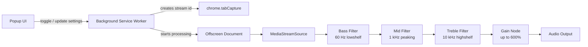

<div align="center">
  

  <h1>Super Volume Booster & Equalizer</h1>

  <p>
    <strong>Free, open-source, privacy-first volume booster and equalizer for Chrome.</strong>
  </p>

  <p>
    Boost tab audio up to <strong>600%</strong>, tune bass/mids/treble, and keep your settings locally —
    no tracking, no analytics, no remote servers.
  </p>

  <p>
    <a href="./LICENSE"></a>
    
    
    
    
  </p>

  <p>
    <a href="#features">Features</a> ·
    <a href="#privacy">Privacy</a> ·
    <a href="#installation">Installation</a> ·
    <a href="#permissions">Permissions</a> ·
    <a href="#contributing">Contributing</a>
  </p>
</div>

---

## Why this extension exists

Many browser audio extensions ask for broad permissions, inject code into pages, or make it difficult to understand what happens with user data. **Super Volume Booster & Equalizer** is built around a different idea: the code should be simple, readable, and transparent.

This project gives users a clean audio booster and equalizer without accounts, analytics, ads, or background data collection.

> The extension processes tab audio locally in the browser using the Web Audio API. It does not send browsing activity, audio, settings, or any personal data to external servers.

## Features

- **Volume boost up to 600%** for the active browser tab.
- **3-band equalizer** for bass, mids, and treble.
- **Built-in presets**: Bass+, Treble+, Rock, Flat.
- **Local settings storage** using `chrome.storage.local`.
- **Manifest V3 architecture** with a background service worker and offscreen audio processor.
- **No telemetry, no analytics, no tracking scripts.**
- **Minimal permission model**: only the permissions required for audio processing.

## Preview

Add a screenshot or GIF here:

```md

```

Recommended visuals:

1. `assets/screenshot-popup.png` — extension popup.
2. `assets/demo.gif` — 5–10 second demo of volume boost and equalizer sliders.
3. `assets/architecture.png` — simple diagram of the audio processing pipeline.

## Architecture



The extension captures audio from the active tab, routes it through a Web Audio graph, applies equalizer filters, applies gain, and outputs the processed signal back to the user.

## Privacy

This project is designed to be privacy-first.

| What | Status |
|---|---|
| Analytics | Not used |
| Tracking scripts | Not used |
| Remote servers | Not used |
| User accounts | Not used |
| Browsing history collection | Not used |
| Audio upload | Never uploaded |
| Settings storage | Local only |

Only the following settings are stored locally:

```json
{
  "volumeBoost": "100-600",
  "eq": {
    "bass": "-20..20",
    "mid": "-20..20",
    "treble": "-20..20"
  }
}
```

See [PRIVACY.md](./PRIVACY.md) for the full privacy policy.

## Permissions

| Permission | Why it is needed |
|---|---|
| `activeTab` | Allows the extension to work with the currently active tab after the user clicks the extension. |
| `tabCapture` | Captures the audio stream from the active tab for local processing. |
| `storage` | Saves volume and equalizer settings locally on the device. |
| `offscreen` | Runs audio processing in an offscreen document required by Manifest V3. |

The extension intentionally avoids broad permissions such as `<all_urls>` and does not request access to all websites by default.

## Installation

### Install from source

1. Download or clone this repository.
2. Open Chrome and go to `chrome://extensions/`.
3. Enable **Developer mode**.
4. Click **Load unpacked**.
5. Select the project folder.
6. Pin the extension and open any tab with audio.

```bash
git clone https://github.com/YOUR_USERNAME/super-volume-booster-equalizer.git
cd super-volume-booster-equalizer
```

### Repository structure

```text
super-volume-booster-equalizer/
├── manifest.json
├── background.js
├── popup.html
├── popup.js
├── offscreen.html
├── offscreen.js
├── icons/
│   ├── icon16.png
│   ├── icon48.png
│   └── icon128.png
├── assets/
│   ├── logo.png
│   ├── screenshot-popup.png
│   └── demo.gif
├── docs/
│   ├── ARCHITECTURE.md
│   ├── INSTALLATION.md
│   └── STORE_LISTING.md
├── PRIVACY.md
├── SECURITY.md
├── CONTRIBUTING.md
├── CHANGELOG.md
└── LICENSE
```

## Development

No build step is required. The extension is written in plain HTML, CSS, and JavaScript.

To check JavaScript syntax locally:

```bash
node --check background.js
node --check popup.js
node --check offscreen.js
```

## Roadmap

- [ ] Add screenshots and short demo GIF.
- [ ] Add Chrome Web Store page.
- [ ] Add more equalizer presets.
- [ ] Add per-site audio profiles.
- [ ] Add a 5-band or 10-band equalizer mode.
- [ ] Add import/export of settings.
- [ ] Add English/Russian UI localization.
- [ ] Explore Firefox support.

## Contributing

Contributions are welcome. Good first issues include:

- UI improvements.
- New EQ presets.
- Documentation fixes.
- Accessibility improvements.
- Testing on different websites and operating systems.

Read [CONTRIBUTING.md](./CONTRIBUTING.md) before opening a pull request.

## Security

If you find a vulnerability or a privacy issue, please do not open a public issue. See [SECURITY.md](./SECURITY.md).

## License

Distributed under the MIT License. See [LICENSE](./LICENSE) for details.

---

<div align="center">
  <strong>⭐ If this project helps you, please consider giving it a star.</strong>
</div>
