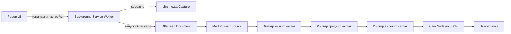

<div align="center">
  

  <h1>Super Volume Booster & Equalizer</h1>

  <p>
    <strong>Бесплатное open-source расширение для Chrome: усилитель громкости и эквалайзер без слежки.</strong>
  </p>

  <p>
    Усиливайте звук активной вкладки до <strong>600%</strong>, настраивайте низкие, средние и высокие частоты,
    сохраняйте настройки локально — без рекламы, аналитики, трекеров и внешних серверов.
  </p>

  <p>
    <a href="./LICENSE"></a>
    
    
    
  </p>
</div>

---

## Зачем нужен проект

Многие браузерные расширения для усиления звука требуют слишком широкие разрешения или не дают пользователю понять, что происходит с его данными. **Super Volume Booster & Equalizer** сделан по другому принципу: код должен быть открытым, простым для проверки и максимально прозрачным.

Расширение усиливает звук и позволяет настраивать эквалайзер, но не использует аккаунты, аналитику, рекламу, трекеры и внешние серверы.

## Возможности

- **Усиление громкости до 600%** для активной вкладки браузера.
- **3-полосный эквалайзер**: низкие, средние и высокие частоты.
- **Готовые пресеты**: Басы+, Верхи+, Рок, Сброс.
- **Локальное сохранение настроек** через `chrome.storage.local`.
- **Архитектура Manifest V3**: service worker + offscreen audio processor.
- **Без телеметрии, аналитики и трекеров.**
- **Минимально необходимые разрешения** для обработки звука.

## Приватность

Проект построен вокруг идеи privacy-first.

| Что проверяем | Статус |
|---|---|
| Аналитика | Не используется |
| Трекеры | Не используются |
| Внешние серверы | Не используются |
| Аккаунты пользователей | Не используются |
| Сбор истории браузера | Не используется |
| Загрузка аудио на сервер | Не выполняется |
| Хранение настроек | Только локально |

Локально сохраняются только выбранные пользователем параметры громкости и эквалайзера.

Подробнее: [PRIVACY.md](./PRIVACY.md).

## Разрешения

| Разрешение | Зачем нужно |
|---|---|
| `activeTab` | Работа с текущей активной вкладкой после действия пользователя. |
| `tabCapture` | Захват аудиопотока активной вкладки для локальной обработки. |
| `storage` | Сохранение настроек громкости и эквалайзера на устройстве пользователя. |
| `offscreen` | Запуск фоновой обработки аудио в offscreen-документе Manifest V3. |

Расширение намеренно не запрашивает широкие права вроде `<all_urls>`.

## Установка из исходного кода

1. Скачайте или клонируйте репозиторий.
2. Откройте Chrome и перейдите на страницу `chrome://extensions/`.
3. Включите **Режим разработчика**.
4. Нажмите **Загрузить распакованное расширение**.
5. Выберите папку проекта.
6. Закрепите расширение и откройте вкладку со звуком.

```bash
git clone https://github.com/YOUR_USERNAME/super-volume-booster-equalizer.git
cd super-volume-booster-equalizer
```

## Архитектура



## Как помочь проекту

Можно помочь даже без глубокого знания расширений Chrome:

- поставить звезду репозиторию;
- протестировать расширение на разных сайтах;
- предложить новый пресет эквалайзера;
- улучшить интерфейс;
- исправить документацию;
- открыть issue с найденной проблемой.

## Лицензия

Проект распространяется под лицензией MIT. Подробнее: [LICENSE](./LICENSE).

---

<div align="center">
  <strong>⭐ Если проект оказался полезен, поставьте звезду на GitHub.</strong>
</div>
